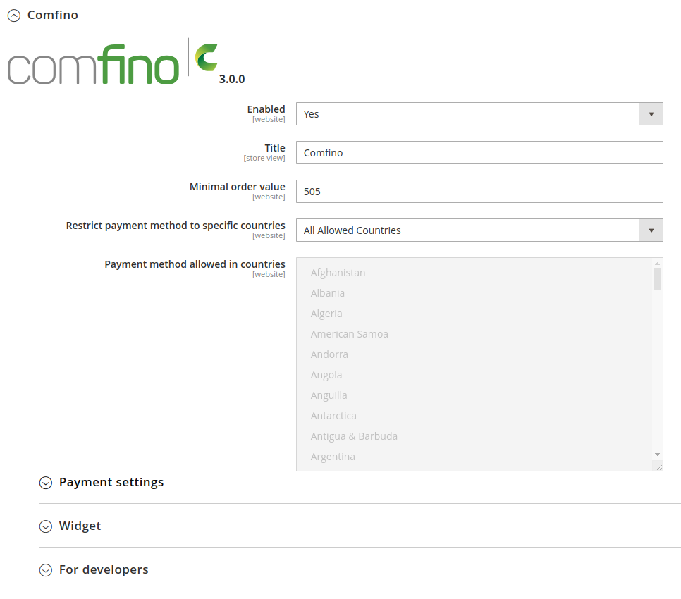
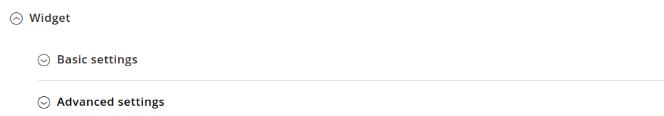

## DOWNLOAD PLUGIN

Open page https://github.com/comfino/Magento-2.3/releases and download latest plugin.

## INSTALLATION

Magento 2.3.5+
-------

**It is recommended to make a complete backup of the Magento directory before installing the module.**

After downloading the comfino.zip archive and unpacking, move the contents of the *comfino* directory to the Magento modules directory.

Target location: *magento/app/code/Comfino/ComfinoGateway*

where:

* *magento* - the name of the base directory of the store (may be different than in the above example)
* *Comfino*, *ComfinoGateway* - subdirectories that should be created in the directory *app/code*

After copying the files, run the command below to check if the new module has been recognized:

`./bin/magento module:status`

The executed command should return a response similar to the following:

The *Comfino_ComfinoGateway* module should be present on the list of inactive modules.

In order to activate the module, execute the following commands:

* `./bin/magento module:enable Comfino_ComfinoGateway --clear-static-content`
* `./bin/magento setup:upgrade`
* `./bin/magento setup:di:compile`
* `./bin/magento setup:static-content:deploy -f`
* `./bin/magento cache:flush`

After completing the above steps, log in to the Magento admin panel to configure the installed module.

## CONFIGURATION

To access the module settings, follow the steps below:

## CONFIGURATION SECTIONS

The configuration parameters of the module are grouped by categories corresponding to the sections of the configuration panel: `"Payment settings"`, `"Widget"`, `"For developers"`.
The last section `"Plugin diagnostics"` does not contain any parameters to be set and has an information-diagnostic function. Among other things, it contains a local error log.

Before using Comfino payments, the module must be configured.

The most important field that must be filled in is the "API Key" field from the `"Payment settings"` section.
In the `"For developers"` section, there is a second key field - `"Test environment API key"`.

Configuration parameter fields:

**Payment settings**

* **Enabled** — activity status of the Comfino module (visibility on the list of payment methods in the basket)
* **Title** — text displayed on the list of payment methods (default `"(Raty | Kup Teraz, Zapłać Póżniej | Finansowanie dla Firm)"`)
* **Minimal order value** — the value of the cart from which Comfino payment is available (default: 30 PLN)
* **Restrict payment method to specific countries** — countries for which Comfino payment is available (default: no restrictions)
* **API key** — a unique access key that allows the module to communicate with the Comfino API (you will receive it from a Comfino representative)

**Widget**

**Basic Settings**

* **Widget is active?** — promotional widget activation/deactivation switch on the product page
* **Widget type** — way of presenting the widget [`Textual widget`, `Graphical widget with banner`, `Graphical widget with installments calculator`]
* **Offer type** — type of financing offer promoted [`Zero percent installments`, `Convenient installments`, `Pay later`, `Deferred payments for companies`]

The availability of offer types on the list depends on the individual contract and may differ from that described in the documentation.

**Advanced settings**

* **Widget price element selector** — HTML document element containing the price of the product
* **Widget anchor element selector** — widget container element (widget is embedded in it)
* **Price change detection — container selector** — HTML document element containing a price element directly or indirectly used to track price changes and recalculate offers
* **Price change detection — container hierarchy level** — DOM hierarchy level used to track price changes and recalculate offers
* **Embedding method** — how the widget is oriented relative to the container element [`INSERT_INTO_FIRST`, `INSERT_INTO_LAST`, `INSERT_BEFORE`, `INSERT_AFTER`]
* **Widget initialization code** — JavaScript script to initialize the widget on the product page (making changes not recommended for non-advanced users without JavaScript knowledge)

Detailed information on the operation of the widget and its configuration options can be found in a separate [Comfino widget documentation](https://comfino.pl/widgets/comfino-magento/en).

**For developers**

* **Use test environment** — developer mode activation/deactivation switch
* **Test environment API key** — a unique access key enabling the module to communicate with the Comfino test API

**Note**

Before launching payments on the production store, disable developer mode to block the use of the Comfino payment test environment.

**Plugin diagnostics**

The section contains technical information about the plugin and the environment (plugin version, store version, PHP and web server version, etc.).\
It also contains a list of recent errors with a preview of the local error log.

Information about developer mode activity is displayed in the `"Plugin diagnostics"` section.
In this mode, the plugin uses the key from the `"For developers"` section to communicate with the Comfino test API. You will also receive a test environment key from a Comfino representative.

## DEACTIVATION

In order to deactivate the module, run the following command in the console from the Magento root directory:

`./bin/magento module:disable Comfino_ComfinoGateway`

## REMARKS

* The Comfino payment module requires you to set the customer's phone number as required in the process of entering the customer's contact details. The phone number is used to send codes and inform the customer about the status of the transaction, at a later stage of Comfino payment processing. In case of absence of a telephone number, the Comfino payment transaction will end with an error displayed on the store's website.
* The module notification system requires the availability of the HTTP "PUT" method. The module receives information about changes in the status of Comfino transactions and changes the internal order status in Magento accordingly. In case of problems with notifications, check the web server settings in your hosting panel.
* Customer and order data required by the Comfino module:
    * Customer:
        * first name - 2-63 characters
        * last name - 2-63 characters
        * email address - valid e-mail address
        * valid Polish mobile phone number (expected format: xxxxxxxxx, xxx xxx xxx, +48 xxxxxxxxx).
    * Cart:
        * total amount
        * list of products
            * name
            * quantity
            * price
    * Address:
        * street
        * building number
        * apartment number
        * postal code
        * city
        * country code

## COMFINO PROCESS FLOW

