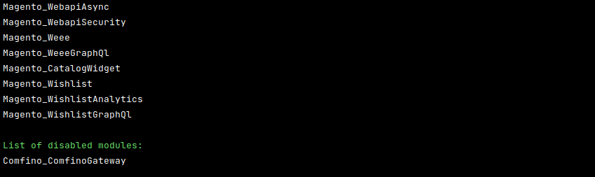

## DOWNLOAD PLUGIN

Open page https://github.com/comfino/Magento-2.3/releases and download latest plugin.

## INSTALLATION

Magento 2.3.5+
-------

**It is recommended to make a complete backup of the Magento directory before installing the module.**

After downloading the comfino.zip archive and unpacking, move the contents of the *comfino* directory to the Magento modules directory.

Target location: *magento/app/code/Comfino/ComfinoGateway*

where:

* *magento* - the name of the base directory of the store (may be different than in the above example)
* *Comfino*, *ComfinoGateway* - subdirectories that should be created in the directory *app/code*

After copying the files, run the command below to check if the new module has been recognized:

`./bin/magento module:status`

The executed command should return a response similar to the following:

The *Comfino_ComfinoGateway* module should be present on the list of inactive modules.

In order to activate the module, execute the following commands:

* `./bin/magento module:enable Comfino_ComfinoGateway --clear-static-content`
* `./bin/magento setup:upgrade`
* `./bin/magento setup:di:compile`
* `./bin/magento setup:static-content:deploy -f`
* `./bin/magento cache:flush`

After completing the above steps, log in to the Magento admin panel to configure the installed module.

## CONFIGURATION

To access the module settings, follow the steps below:

## CONFIGURATION SECTIONS

The most important field that should be completed is: `"API key"`.

## DEACTIVATION

In order to deactivate the module, run the following command in the console from the Magento root directory:

`./bin/magento module:disable Comfino_ComfinoGateway`

## REMARKS

* Remember to activate the module (first option in the module settings form) to make it available at frontend side.

## NOTIFICATION STATUSES:

Zmieniają status zamówenia na kompletny. Wynikiem jest faktura i wysyłka towaru.

* ACCEPTED
* WAITING_FOR_PAYMENT
* PAID
