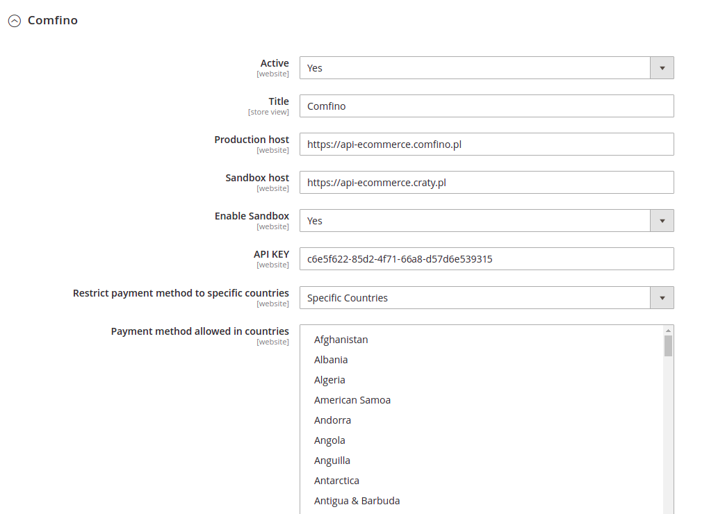

## POBIERANIE WTYCZKI

Otwórz stronę https://github.com/comfino/Magento-2.3/releases i pobierz najnowszą wersję wtyczki.

## INSTALACJA

Magento 2.3.5+
-------

**Przed instalacją modułu zalecane jest wykonanie kompletnej kopii zapasowej katalogu Magento.**

Po pobraniu archiwum comfino.zip i rozpakowaniu, przenieś zawartość katalogu *comfino* do katalogu modułów Magento.

Docelowa lokalizacja: *magento/app/code/Comperia/ComperiaGateway*

gdzie:

* *magento* - nazwa katalogu bazowego sklepu (może być inna niż w powyższym przykładzie)
* *Comperia*, *ComperiaGateway* - podkatalogi, które należy utworzyć w katalogu *app/code*

Po skopiowaniu plików wywołaj poniższe polecenie w celu sprawdzenia, czy nowy moduł został rozpoznany:

`./bin/magento module:status`

Wykonane polecenie powinno zwrócić odpowiedź podobną do poniższej:

Moduł *Comperia_ComperiaGateway* powinien być na liście nieaktywnych modułów.

W celu aktywacji modułu wywołaj poniższe polecenia:

* `./bin/magento module:enable Comperia_ComperiaGateway --clear-static-content`
* `./bin/magento setup:upgrade`
* `./bin/magento setup:di:compile`
* `./bin/magento setup:static-content:deploy -f`
* `./bin/magento cache:flush`

Po wykonaniu powyższych czynności zaloguj się do panelu administracyjnego Magento, aby skonfigurować zainstalowany moduł.

## KONFIGURACJA

Aby uzyskać dostęp do ustawień modułu, wykonaj poniższe kroki:

Pole które jest najbardziej istotne i należy je wypełnić to: `"API KEY"`.

## DEAKTYWACJA

W celu deaktywacji modułu należy wywołać w konsoli poniższe polecenie z poziomu katalogu głównego Magento:

`./bin/magento module:disable Comperia_ComperiaGateway`

## UWAGI

* Aby moduł mógł działać, należy pamiętać o aktywacji (pierwsza opcja w formularzu ustawień modułu).

## STATUSY NOTYFIKACJI:

Zmieniają status zamówenia na kompletny. Wynikiem jest faktura i wysyłka towaru.

* ACCEPTED
* WAITING_FOR_PAYMENT
* PAID
