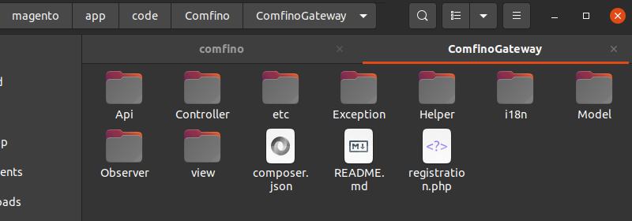

## POBIERANIE WTYCZKI

Otwórz stronę https://github.com/comfino/Magento-2.3/releases i pobierz najnowszą wersję wtyczki.

## INSTALACJA

Magento 2.3.5+
-------

**Przed instalacją modułu zalecane jest wykonanie kompletnej kopii zapasowej katalogu Magento.**

Po pobraniu archiwum comfino.zip i rozpakowaniu, przenieś zawartość katalogu *comfino* do katalogu modułów Magento.

Docelowa lokalizacja: *magento/app/code/Comfino/ComfinoGateway*

gdzie:

* *magento* - nazwa katalogu bazowego sklepu (może być inna niż w powyższym przykładzie)
* *Comfino*, *ComfinoGateway* - podkatalogi, które należy utworzyć w katalogu *app/code*

Po skopiowaniu plików wywołaj poniższe polecenie w celu sprawdzenia, czy nowy moduł został rozpoznany:

`./bin/magento module:status`

Wykonane polecenie powinno zwrócić odpowiedź podobną do poniższej:

Moduł *Comfino_ComfinoGateway* powinien być na liście nieaktywnych modułów.

W celu aktywacji modułu wywołaj poniższe polecenia:

* `./bin/magento module:enable Comfino_ComfinoGateway --clear-static-content`
* `./bin/magento setup:upgrade`
* `./bin/magento setup:di:compile`
* `./bin/magento setup:static-content:deploy -f`
* `./bin/magento cache:flush`

Po wykonaniu powyższych czynności zaloguj się do panelu administracyjnego Magento, aby skonfigurować zainstalowany moduł.

## KONFIGURACJA

Aby uzyskać dostęp do ustawień modułu, wykonaj poniższe kroki:

## SEKCJE KONFIGURACJI

Parametry konfiguracyjne modułu są pogrupowane kategoriami odpowiadającymi rozwijanym sekcjom panelu konfiguracyjnego: `"Ustawienia płatności"`, `"Widget"`, `"Dla developerów"`.
Ostatnia sekcja `"Diagnostyka wtyczki"` nie zawiera żadnych parametrów do ustawienia i pełni funkcję informacyjno-diagnostyczną. Zawiera między innymi lokalny dziennik błędów (log błędów).

Przed użyciem płatności Comfino, moduł musi zostać skonfigurowany.

Najważniejsze pole, które musi być uzupełnione, to pole `"Klucz API"` z sekcji `"Ustawienia płatności"`.
W sekcji `"Dla developerów"` znajduje się pole drugiego klucza - `"Klucz API środowiska testowego"`.

Pola parametrów konfiguracyjnych:

**Ustawienia płatności**

* **Włączone** — status aktywności modułu Comfino (widoczność na liście metod płatności w koszyku)
* **Tytuł** — tekst wyświetlany na liście metod płatności (domyślnie `"Comfino (Raty | Kup Teraz, Zapłać Później | Finansowanie dla Firm)"`)
* **Minimalna wartość zamówienia** — wartość koszyka, od której dostępna jest płatność Comfino (domyślnie: 30 zł)
* **Ograniczenie metody płatności do określonych państw** — kraje, dla których dostępna jest płatność Comfino (domyślnie: brak ograniczeń)
* **Klucz API** — unikalny klucz dostępowy umożliwiający komunikację modułu z API Comfino (otrzymasz go od przedstawiciela Comfino)

**Widget**

**Ustawienia podstawowe**

* **Widget włączony?** — przełącznik aktywacji/deaktywacji widgetu promocyjnego na stronie produktu
* **Typ widgetu** — sposób prezentacji widgetu [`Widget tekstowy`, `Widget graficzny z banerem`, `Widget graficzny z kalkulatorem rat`]
* **Typ oferty** — typ promowanej oferty finansowania [`Raty zero procent`, `Niskie raty`, `Zapłać później`, `Odroczone płatności dla firm`]

Dostępność typów ofert na liście jest uzależniona od indywidualnej umowy i może różnić się od tej opisanej w dokumentacji.

**Ustawienia zaawansowane**

* **Selektor elementu ceny widgetu** — element dokumentu HTML zawierający cenę produktu
* **Selektor elementu zakotwiczenia widgetu** — element kontenera widgetu (w nim jest osadzany widget)
* **Wykrywanie zmian ceny — selektor kontenera** — element dokumentu HTML zawierający w sobie element ceny bezpośrednio lub pośrednio używany do śledzenia zmian cen i przeliczania ofert
* **Wykrywanie zmian ceny — poziom hierarchii kontenera** — poziom hierarchii DOM używany do śledzenia zmian cen i przeliczania ofert
* **Metoda osadzania** — sposób orientacji widgetu względem elementu kontenera [`INSERT_INTO_FIRST`, `INSERT_INTO_LAST`, `INSERT_BEFORE`, `INSERT_AFTER`]
* **Kod inicjalizacji widgetu** — skrypt JavaScript inicjalizujący widget na stronie produktu (wprowadzanie zmian niezalecane dla niezaawansowanych użytkowników bez znajomości JavaScript)

Szczegółowe informacje o działaniu widgetu i jego opcjach konfiguracyjnych znajdziesz w osobnej [dokumentacji widgetu Comfino](https://comfino.pl/widgets/comfino-magento/pl).

**Dla developerów**

* **Użyj środowiska testowego** — przełącznik aktywacji/deaktywacji trybu deweloperskiego
* **Klucz API środowiska testowego** — unikalny klucz dostępowy umożliwiający komunikację modułu z testowym API Comfino

**Uwaga**

Przed uruchomieniem płatności na sklepie produkcyjnym, wyłącz tryb deweloperski, aby zablokować użycie środowiska testowego płatności Comfino.

**Diagnostyka wtyczki**

Sekcja zawiera informacje techniczne o wtyczce i środowisku (wersja wtyczki, wersja sklepu, wersja PHP i serwera www, itp.).\
Zawiera też listę ostatnich błędów wraz z podglądem lokalnego dziennika błędów (log błędów).

Informacja o aktywności trybu deweloperskiego jest wyświetlana w sekcji `"Diagnostyka wtyczki"`.
W trybie tym wtyczka używa klucza z sekcji `"Dla developerów"` do komunikacji z testowym API Comfino. Klucz środowiska testowego również otrzymasz od przedstawiciela Comfino.

## DEAKTYWACJA

W celu deaktywacji modułu należy wywołać w konsoli poniższe polecenie z poziomu katalogu głównego Magento:

`./bin/magento module:disable Comfino_ComfinoGateway`

## UWAGI

* Moduł płatności Comfino wymaga ustawienia numeru telefonu klienta jako wymaganego w procesie wprowadzania danych kontaktowych klienta. Numer telefonu jest używany do przesyłania kodów i informowania klienta o statusie transakcji, na dalszym etapie procesowania płatności Comfino. W przypadku braku numeru telefonu transakcja płatnicza Comfino zakończy się błędem wyświetlonym na stronie sklepu.
* System notyfikacji modułu wymaga dostępności metody HTTP "PUT". Moduł otrzymuje informacje o zmianach statusu transakcji Comfino i stosownie zmienia wewnętrzny status zamówienia w Magento. W przypadku problemów z notyfikacjami należy sprawdzić ustawienia serwera www w Twoim panelu hostingu.
* Dane klienta i zamówienia wymagane przez moduł Comfino:
    * Klient:
        * imię — 2-63 znaków
        * nazwisko — 2-63 znaków
        * e-mail — poprawny adres e-mail
        * telefon — poprawny polski numer komórkowy (oczekiwany format: xxxxxxxxx, xxx xxx xxx, +48 xxxxxxxxx).
    * Koszyk:
        * kwota koszyka
        * lista produktów
            * nazwa
            * ilość
            * cena
    * Adres:
        * ulica
        * numer budynku
        * numer mieszkania
        * kod pocztowy
        * miasto
        * kod kraju

## PRZEBIEG PROCESU COMFINO

